# 🤖 Multimodal AI Assistant

A multimodal AI assistant built with **Python, Streamlit, LangGraph, Google Gemini, Hugging Face Inference Providers, and SQLite**.

The application combines conversational AI, prompt-engineered response modes, programming assistance, code-file analysis, image understanding, image generation, and persistent chat management in a lightweight Streamlit application.

---

## ✨ Features

### 🧠 Three AI Modes

The chatbot supports three task-specific modes:

#### 💬 General Assistant

For:

* General questions
* Explanations
* Learning
* Summaries
* Everyday conversations

Powered by **Google Gemini**.

#### 💻 Code Assistant

For:

* Code explanation
* Debugging
* Error analysis
* Code generation
* Code improvement
* Refactoring
* Code-file analysis

Supports source/text files such as:

```text
.py
.js
.java
.c
.cpp
.cs
.html
.css
.sql
.json
.txt
```

Generated or revised code can be downloaded directly.

#### 🎨 Image Generator

Generate images from natural-language descriptions using **Hugging Face Inference Providers** and a supported image-generation model.

Example:

> A futuristic university campus surrounded by mountains at sunset, cinematic digital art.

Generated images can be previewed and downloaded as PNG files.

---

## 📸 Screenshots

### Main Interface

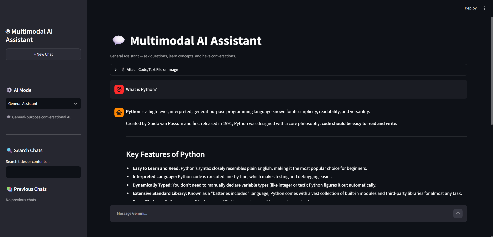

### AI Modes

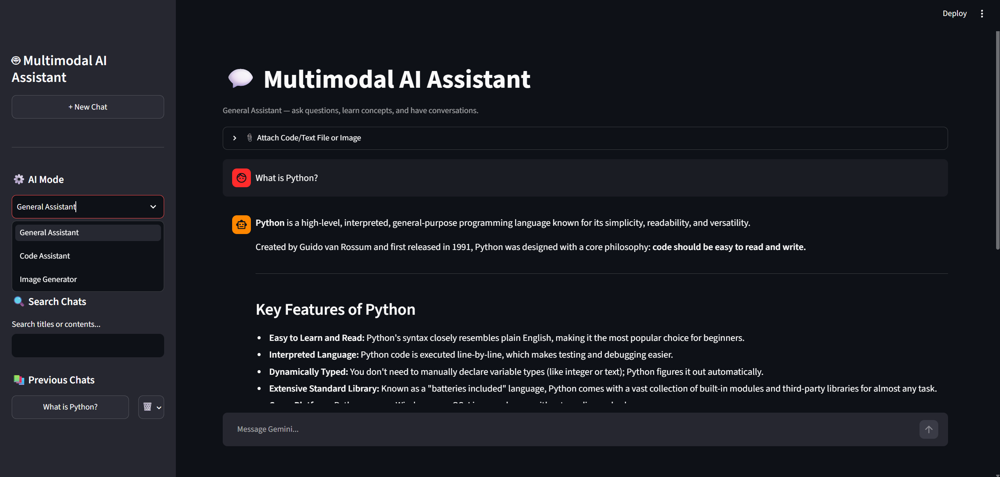

### Code Assistant

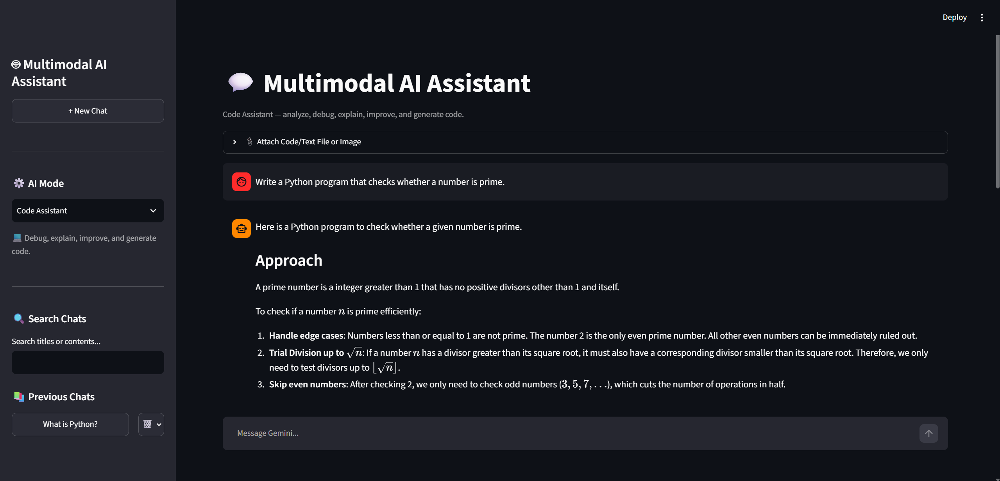
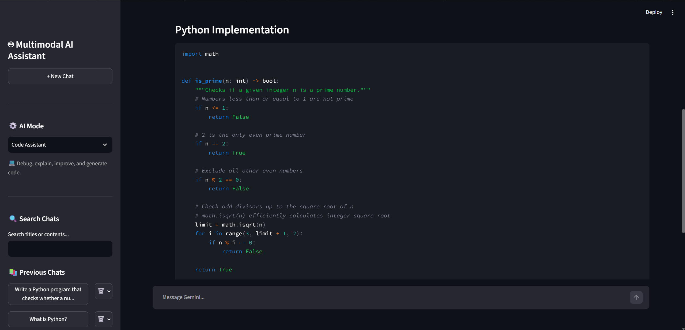
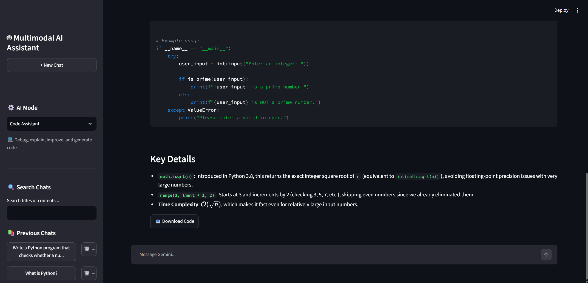

### Code File Analysis

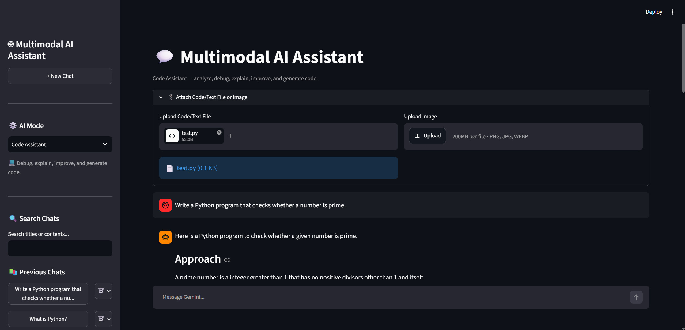
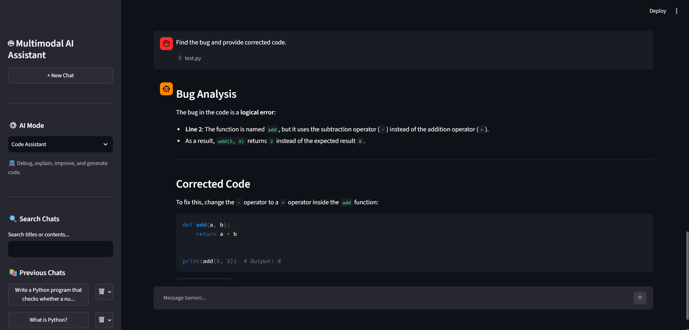

### Image Analysis

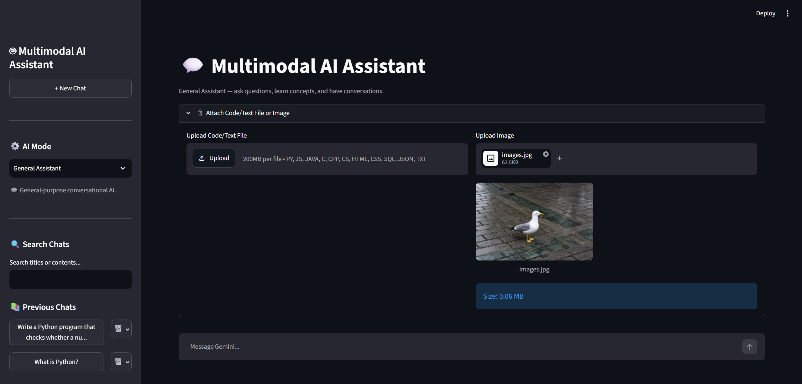
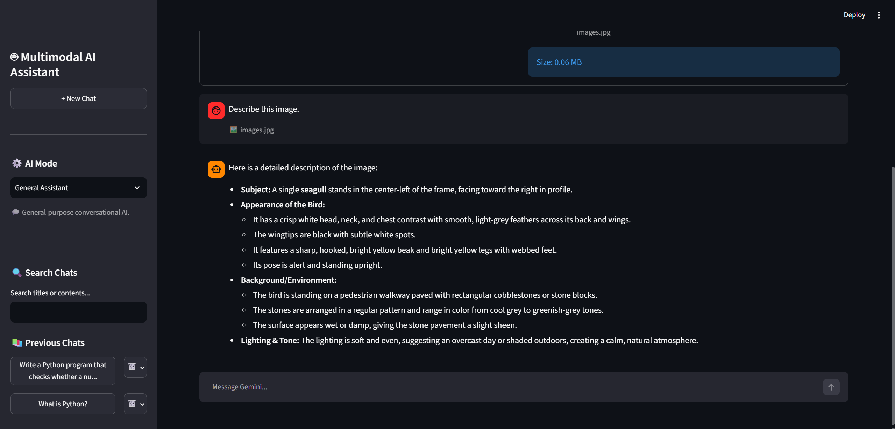

### Image Generator

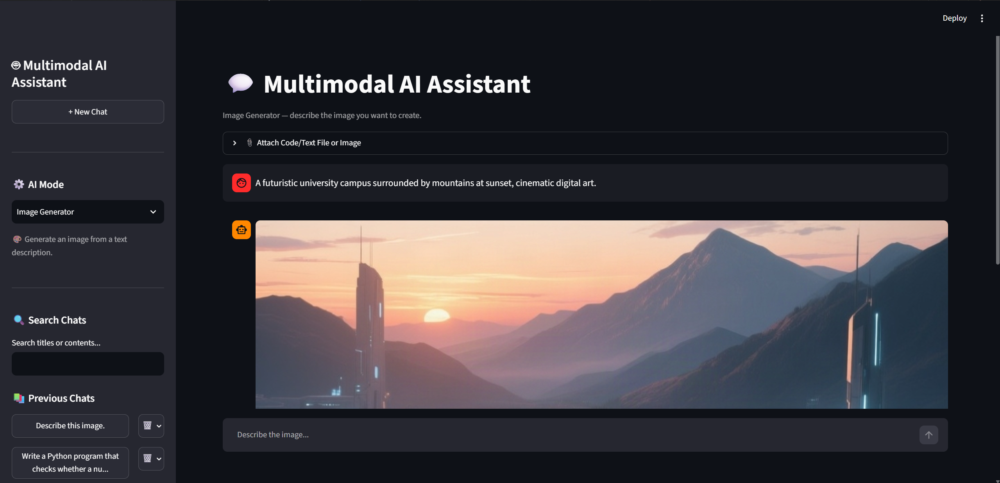

### Chat Search

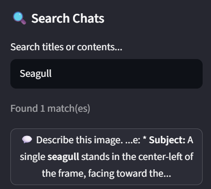

---

## 🧩 Core Capabilities

### 💬 Conversational AI

* Google Gemini-powered conversations
* Streaming responses
* Persistent conversation context
* Multiple independent chat threads
* Create new chats
* Open previous chats
* Continue existing conversations

### 🔎 Chat Search

Search stored conversations using:

* Chat titles
* User messages
* Assistant responses

Search results provide a matching conversation and a relevant content snippet.

### 🗑️ Chat Deletion

Individual conversations can be deleted from the sidebar.

Deleting the currently active conversation automatically creates a fresh chat.

### 📁 Code/Text File Input

Upload supported source-code or text files and use them as context for the Code Assistant.

Example workflow:

```text
Upload calculator.py
        ↓
Select Code Assistant
        ↓
"Find the errors and improve this code."
        ↓
Gemini
        ↓
Corrected code
        ↓
Download
```

Uploaded code is treated as text and **is not executed by the application**.

### 🖼️ Image Understanding

Upload an image and ask questions about it using Gemini's multimodal capabilities.

Examples:

* Explain a diagram
* Analyze a screenshot
* Describe visual content
* Identify information in an image
* Explain an educational figure

### 🎨 Image Generation

Image generation is implemented as an AI response mode rather than a separate tool.

```text
AI Mode
├── General Assistant
├── Code Assistant
└── Image Generator
```

Selecting **Image Generator** changes the normal chat input into an image-generation workflow.

---

# 🧠 Prompt Engineering

Prompt engineering is an important part of the application.

The same overall chatbot interface can behave differently depending on the selected AI mode.

### General Assistant Prompting

The General Assistant is instructed to:

* Answer clearly and accurately
* Adapt explanation depth
* Use Markdown when useful
* Avoid unnecessary code
* Avoid inventing facts

### Code Assistant Prompting

The Code Assistant is instructed to:

* Identify programming languages when possible
* Explain programming approaches
* Analyze syntax, logic, runtime, and design problems
* Provide corrected or improved code
* Explain important changes
* Preserve the user's intent
* Never claim code was executed unless it actually was

### Image Generation Prompting

User image descriptions are enhanced before being sent to the image-generation model.

The enhancement provides additional instructions relating to:

* Subject
* Composition
* Lighting
* Environment
* Mood
* Artistic style

Conceptually:

```text
User Description
       ↓
Prompt Enhancement
       ↓
Image Generation Prompt
       ↓
Hugging Face Inference
       ↓
Generated Image
```

---

# 🏗️ Architecture

```text
                         ┌──────────────────────┐
                         │      Streamlit       │
                         │       Web UI         │
                         └──────────┬───────────┘
                                    │
                         ┌──────────┴──────────┐
                         │                     │
                         ▼                     ▼
                  AI Mode Selector       Chat Management
                         │                     │
          ┌──────────────┼──────────────┐     │
          │              │              │     │
          ▼              ▼              ▼     ├── Search
       General         Code           Image   └── Delete
       Assistant     Assistant       Generator
          │              │              │
          ▼              ▼              ▼
       Gemini          Gemini       Hugging Face
          │              │          Inference API
          │              │              │
          └──────────────┴──────────────┘
                         │
                         ▼
                  SQLite / LangGraph
                  Persistent History
```

---

# 🔄 General / Code Chat Flow

```text
User
  ↓
Streamlit
  ↓
Select AI Mode
  ↓
LangGraph
  ↓
Mode-specific System Prompt
  ↓
Conversation Context
  ↓
Google Gemini
  ↓
Streaming Response
  ↓
Streamlit
  ↓
SQLite Checkpoint
```

---

# 🖼️ Image Analysis Flow

```text
Upload Image
     ↓
Validate File
     ↓
Combine Image + User Question
     ↓
Google Gemini
     ↓
Multimodal Response
```

---

# 🎨 Image Generation Flow

```text
Select Image Generator
        ↓
Enter Image Description
        ↓
Prompt Enhancement
        ↓
Hugging Face Inference Providers
        ↓
Image Model
        ↓
Generated Image
        ↓
Preview
        ↓
Download PNG
```

---

# 🔍 Chat Search Flow

```text
Search Query
     ↓
SQLite / LangGraph Conversations
     ↓
Search Titles + Message Content
     ↓
Matching Conversations
     ↓
Open Selected Chat
```

---

# 🛠️ Tech Stack

| Technology                           | Purpose                                       |
| ------------------------------------ | --------------------------------------------- |
| **Python**                           | Application logic                             |
| **Streamlit**                        | Web interface                                 |
| **LangGraph**                        | Conversation workflow and state               |
| **LangChain**                        | LLM integration                               |
| **Google Gemini API**                | General AI, coding, image understanding       |
| **Hugging Face Inference Providers** | Image generation                              |
| **Qwen-Image**                       | Image generation model used by the image mode |
| **SQLite**                           | Persistent chat storage                       |
| **python-dotenv**                    | Environment variable management               |

---

# 📁 Project Structure

```text
Project/
│
├── app.py
├── backend.py
├── .env
├── chatbot.db
└── venv/
```

`chatbot.db` is created automatically when the application uses SQLite checkpointing.

---

# 🚀 Installation

## 1. Clone the repository

```bash
git clone https://github.com/SaurabhBhuptani/PEGAI/tree/main/Project_Enhancement.git
cd Project_Enhancement
```

Replace the placeholders with your actual GitHub repository.


## 2. Create a virtual environment

### Windows

```powershell
python -m venv venv
```

Activate it:

```powershell
venv\Scripts\Activate.ps1
```


## 3. Install dependencies

```powershell
pip install -U streamlit langgraph langgraph-checkpoint-sqlite langchain-google-genai python-dotenv huggingface_hub
```


## 4. Configure API keys

Create a `.env` file in the project root:

```env
GEMINI_API_KEY=YOUR_GEMINI_API_KEY
HF_TOKEN=YOUR_HUGGINGFACE_TOKEN
```

The application uses:

* `GEMINI_API_KEY` for Gemini-powered features.
* `HF_TOKEN` for Hugging Face image generation.


## 5. Start the application

```powershell
streamlit run app.py
```

Then open the local Streamlit URL shown in the terminal, normally:

```text
http://localhost:8501
```

---

# 🧪 Example Usage

## General Assistant

Select:

```text
General Assistant
```

Ask:

```text
Explain normalization in DBMS with examples.
```


## Code Assistant

Select:

```text
Code Assistant
```

Ask:

```text
Explain this Python code and identify any potential problems.
```

You can also upload a source file and request:

```text
Find bugs and provide corrected code.
```


## Image Understanding

Upload an image and ask:

```text
Explain this diagram in simple terms.
```


## Image Generation

Select:

```text
Image Generator
```

Enter:

```text
A futuristic university campus surrounded by mountains at sunset,
cinematic digital art.
```

The image is generated and can be downloaded as a PNG.


## Chat Search

Use:

```text
🔍 Search Chats
```

and search for terms such as:

```text
Python
SQL
LangGraph
Gemini
```

The application searches stored conversation titles and message content.


## Chat Deletion

Use the delete control beside a previous conversation to remove that chat.

---

# ⚠️ Current Limitations

* API usage is subject to provider quotas, limits, and availability.
* Image generation depends on Hugging Face Inference Provider availability and account credits.
* Uploaded code is analyzed as text and is not executed.
* Uploaded files are limited to the supported extensions and configured size limits.
* Conversation history is stored locally in SQLite.
* Generated images are kept in the current Streamlit session rather than being permanently stored in the conversation database.
* The application currently supports two Gemini-based modes and one Hugging Face-based image-generation mode.

---

# 🔮 Future Improvements

Potential future additions:

* [ ] AI-generated chat titles
* [ ] Conversation summarization
* [ ] Rename conversations
* [ ] Regenerate responses
* [ ] User feedback / ratings
* [ ] More programming languages
* [ ] PDF and DOCX analysis
* [ ] Multiple image-generation styles
* [ ] Image aspect-ratio selection
* [ ] Web search
* [ ] RAG
* [ ] User authentication
* [ ] Cloud database
* [ ] Online deployment

---

# 🎯 Project Goals

The project was designed to demonstrate how multiple AI capabilities can be combined into a simple web application.

Main goals:

1. Build a practical LLM-powered chatbot.
2. Demonstrate prompt engineering using task-specific system prompts.
3. Provide specialized programming assistance.
4. Support multimodal image understanding.
5. Add natural-language image generation.
6. Provide searchable and deletable conversation history.
7. Maintain persistent conversations with SQLite.
8. Keep the application simple enough to run locally with Streamlit.

---

# 👨‍💻 Author

**Saurabh Bhuptani**

Marwadi University

GitHub:

```text
https://github.com/SaurabhBhuptani
```

---

# 📄 License

This project is primarily intended for educational and academic purposes.

---

# 🙏 Acknowledgements

This project makes use of:

* Google Gemini
* LangChain
* LangGraph
* Streamlit
* Hugging Face
* Qwen
* SQLite
* Python

---

## ⭐ If You Find This Project Interesting

Consider giving the repository a ⭐ and exploring the implementation.

The project demonstrates how a simple Streamlit application can combine:

```text
LLM Chat
    +
Prompt Engineering
    +
Code Assistance
    +
File Input
    +
Image Understanding
    +
Image Generation
    +
Chat Search
    +
Chat Management
    =
Multimodal AI Assistant
```
